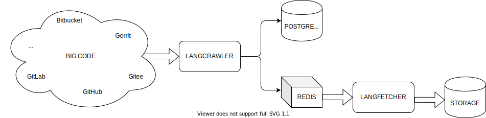

# langcrawler

[](https://github.com/craftslab/langcrawler/actions?query=workflow%3ACI)
[](https://pypi.org/project/langcrawler/)
[](https://github.com/craftslab/langcrawler/blob/master/LICENSE)
[](https://github.com/craftslab/langcrawler/tags)


*langcrawler* is a language crawler written in Python.

See *[Lang Fetcher](https://github.com/craftslab/langfetcher/)* as a language fetcher from *langcrawler*.


## Requirement

- PostgreSQL >= 12.4
- Python >= 3.7
- Redis >= 6.0


## Install

### Ubuntu

```bash
pip install langcrawler
```

### Windows

```
# Install Python, Microsoft Visual C++ and Windows SDK
pip install langcrawler
```


## Update

```bash
pip install langcrawler --upgrade
```


## Run

```bash
langcrawler \
  --pg-address 127.0.0.1:5432 \
  --pg-login postgres/postgres \
  --redis-address 127.0.0.1:6379 \
  --redis-pass redis \
  --repo-count 1 \
  --repo-host gerrit,github,gitlab \
  --repo-lang go,javascript,php,python,rust,typescript
```


## Usage

```bash
usage: crawler.py [-h] [--pg-address PG_ADDRESS] [--pg-login PG_LOGIN]
                  [--redis-address REDIS_ADDRESS] [--redis-pass REDIS_PASS]
                  [--repo-count REPO_COUNT] [--repo-host REPO_HOST]
                  [--repo-lang REPO_LANG] [-v]

Language Crawler

optional arguments:
  -h, --help            show this help message and exit
  --pg-address PG_ADDRESS
                        postgres address (host:port)
  --pg-login PG_LOGIN   postgres login (user/pass)
  --redis-address REDIS_ADDRESS
                        redis address (host:port)
  --redis-pass REDIS_PASS
                        redis pass
  --repo-count REPO_COUNT
                        repository count
  --repo-host REPO_HOST
                        repository host
  --repo-lang REPO_LANG
                        repository language
  -v, --version         show program's version number and exit
```


## Design




## License

Project License can be found [here](https://github.com/craftslab/langcrawler/blob/master/LICENSE).


## Reference

- [Search on Gerrit](https://gerrit-documentation.storage.googleapis.com/Documentation/3.2.3/rest-api.html)
- [Search on GitHub](https://developer.github.com/v3/search/)
- [Search on GitLab](https://docs.gitlab.com/ee/api/api_resources.html)
